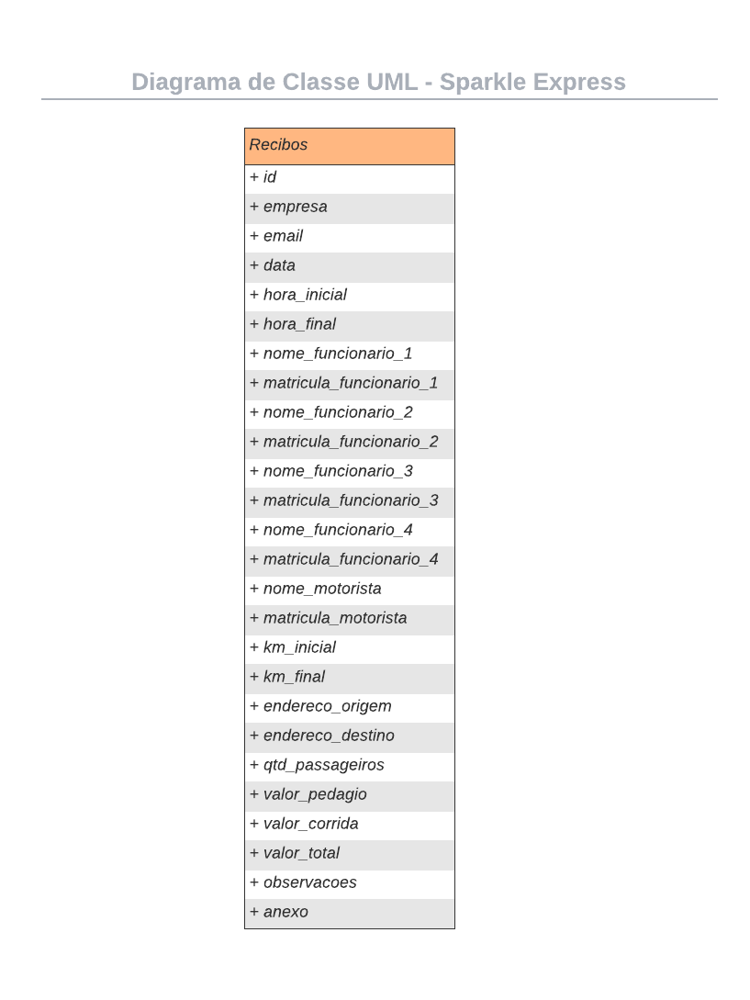

# Sparkle Express

**Nomes:**

- Adilson Antônio Pereira Junior
- Pedro Augusto Costa Senciano
- Raony Lino de Oliveira

<br>

**Descrição do Sistema**

- Criação de um sistema mobile capaz de digitalizar os recibos emitidos em tempo real e encaminhar para o e-mail do financeiro da empresa parceira.

<br>

**Estória de Usuários**

1. Como Alice, quero ter facilidade na locomoção entre as filiais da empresa, para que eu possa otimizar meus horários.
2. Como Márcio, quero agilidade na emissão de recibos para minha empresa, para que os relatórios financeiros possam ser gerados em tempo hábil.
3. Como Ramon, quero ter o controle na prestação dos serviços realizados pelos motoristas da minha companhia de transportes fretados, para que as atividades dos colaboradores e estimativa dos lucros sejam monitoradas.
4. Como Yumi, quero evitar o preenchimento de recibos manuais, para que possa ser amenizada a possibilidade de erro nas informações.
5. Como Marcelo, quero eliminar a emissão de folhas de papeis, para que possamos preservar o meio ambiente.




## Testando o App (depuração pela IDE)

Instale o SDK do [**Flutter**](https://docs.flutter.dev/get-started/install) na versão mais recente do canal **Stable**.
Em seguida [**configure a IDE**](https://docs.flutter.dev/get-started/editor) de preferência.

1 - Abra o terminal na raiz do projeto.
2 - Execute o comando abaixo para baixar os pacotes e dependências do projeto:

```
> flutter pub get
```

3 - Abra o emulador **OU** conecte um dispositivo Android via USB e certifique-se de que a IDE o identificou.
4 - Execute o comando abaixo para instalar e executar o projeto:

```sh
> flutter run
```
___

## Testando o App (Instalação APK)

> Copie o arquivo **installer.apk** para o dispositivo Android e execute-o.
> Ao concluir a instalação basta abri-lo
___
> Caso esteja instalando pelo ADB, execute o seguinte comando via terminal:
```
> adb install installer.apk
```
___
# Credenciais de Acesso

> Ao abrir o APP será solicitado **e-mail** e **senha** para se autenticar:

| Email | Senha |
| ----------------- | ------ |
| teste@pucminas.br | 123456 |


# Emissão de Recibo

> Ao clicar em ***Gerar Recibo***, você será redirecionado para a tela de emissão, na qual se encontram os seguintes campos à serem preenchidos:

#### Preenchimento dos campos:

| Campo | Tipo | Validação |
|--------|--------|--------|
| Empresa | Lista (Item) | Obrigatório |
| Matrícula Func. 1 | Número | Obrigatório |
| Matrícula Func. 2 | Número | Opcional |
| Matrícula Func. 3 | Número | Opcional |
| Matrícula Func. 4 | Número | Opcional |
| Data | DateTime | Obrigatório |
| Hora Inicial | DateTime | Obrigatório |
| Hora Final | DateTime | Obrigatório |
| KM Inicial | Número | Obrigatório |
| KM Final | Número | Obrigatório |
| Endereço Origem | Texto | Obrigatório |
| Endereço Destino | Texto | Obrigatório |
| Valor Pedágio | Número | Opcional |
| Observação | Texto | Opcional |
| Anexo | Imagem | Opcional |

___

# Visualização de Recibo

> Ao clicar em ***Meus Recibos***, você será redirecionado para a tela de visualização, na qual se encontram os recibos que já foram gerados. Esses recibos ficam armazenados internamente utilizando o SQLite.

___


